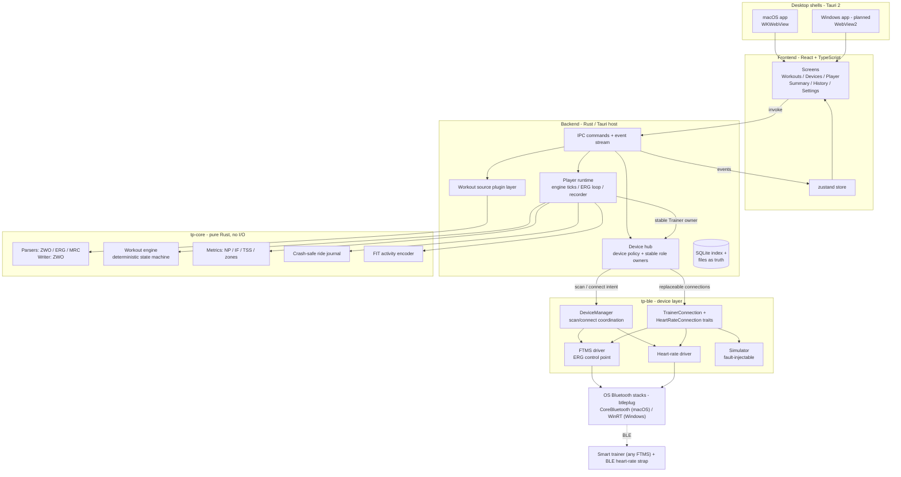

# TrainerPro

[](LICENSE)

A desktop indoor-cycling workout player. Load a structured workout (ZWO / ERG /
MRC), drive a smart trainer over Bluetooth FTMS in ERG mode, and export every
ride as a Garmin-compatible **.FIT** activity.

- **Dashboard player**: zone-colored workout graph, big power/cadence/HR
  numerals, target vs. actual, interval countdown, keyboard controls.
- **ERG control** of FTMS trainers (Wahoo KICKR family and any FTMS trainer),
  with ramp re-targeting, keep-alive, auto-pause on drop, and auto-reconnect.
- **Crash-safe recording**: 1 Hz journal during the ride, FIT encoding at ride
  end, one lap per interval, NP/IF/TSS computed locally.
- **Pluggable workout sources** (local files, a self-hosted
  [WorkoutPlanner](https://github.com/sergioclemente/WorkoutPlanner) server,
  or whatsonzwift.com — remote sources are opt-in) and a built-in trainer
  simulator, so the whole app runs without hardware.

## Status

| Platform | Status |
|---|---|
| macOS | Working (unsigned builds) |
| Windows | Planned — architecture is shared, needs validation + installer signing |
| Linux | Not supported |

## Install

Grab the latest `.dmg` (macOS) from
[Releases](https://github.com/sergioclemente/TrainerPro/releases).

Builds are currently **unsigned**: on macOS, Gatekeeper will refuse the first
launch — right-click the app → **Open** → **Open** (or
`xattr -cr /Applications/TrainerPro.app`). Windows installers will show a
SmartScreen "unknown publisher" warning for the same reason.

## Architecture

Platform shells at the top, physical devices at the bottom; everything between
is shared code.



Two invariants keep this portable and testable:

- **`tp-core` has zero I/O and zero async** — parsers, engine, metrics, journal
  and FIT encoder are pure functions, unit-tested without hardware on any OS.
- **All hardware sits behind `TrainerConnection`/`HeartRateConnection`** —
  the simulator implements the same contracts as the BLE drivers. Stable
  `Trainer` and `HeartRateMonitor` owners replace those connections during
  recovery, so consumers keep one status and measurement subscription.

More detail: [`docs/architecture.md`](docs/architecture.md) (source plugin
interface, ride data flow, cross-platform notes) ·
[`docs/SPEC.md`](docs/SPEC.md) (build spec) ·
[`docs/ALTERNATIVES.md`](docs/ALTERNATIVES.md) (decision records) ·
[`docs/garmin-access.md`](docs/garmin-access.md) (export integration status) ·
[`docs/spec-workoutplanner.md`](docs/spec-workoutplanner.md) (planner
integration).

## Development

Prerequisites: [Rust](https://rustup.rs) (stable), Node 20+, and on macOS the
Xcode Command Line Tools (`xcode-select --install`).

```bash
npm install
npm run tauri:qa         # launches an isolated TrainerPro QA app

# Tests
cargo test --workspace     # core, BLE codecs, planner, woz parsers
npx tsc --noEmit           # frontend types

# Useful diagnostics
TP_PARSE_FILE=some.zwo cargo test -p tp-core parse_env_file -- --ignored --nocapture
cargo test --bin tp-app live_fetch -- --ignored --nocapture   # whatsonzwift live check
```

The QA flavor uses its own app name, bundle identifier, and data directory, so
development workouts, rides, and paired devices do not affect an installed
TrainerPro app. Use the simulated devices for QA; do not connect both app
flavors to the same physical trainer at once. Build a standalone QA app with
`npm run tauri:qa:build -- --bundles app`.

No trainer? Pair the **Simulated KICKR** and **Simulated HRM** from the
Devices screen — they appear in every scan and behave like the real thing
(first-order power response, effort-driven heart rate, fault injection).

## Repository layout

```
frontend/               React frontend (screens, store, IPC client, sources)
backend/                lifecycle, IPC, I/O, device hub, player runtime
crates/tp-core/         pure domain: parsers, engine, metrics, journal, FIT
crates/tp-ble/          BLE: traits, FTMS/HR drivers, simulator
tools/                  maintained internal command-line utilities
docs/                   spec, decision records, architecture notes
assets/icon/            app icon sources (SVG masters + candidates)
samples/                example workout files
```

## Contributing

See [`CONTRIBUTING.md`](CONTRIBUTING.md) — short version: discuss features in
an issue first, keep `tp-core` pure, keep hardware behind the device traits,
and bring tests.

## License

[MIT](LICENSE).
