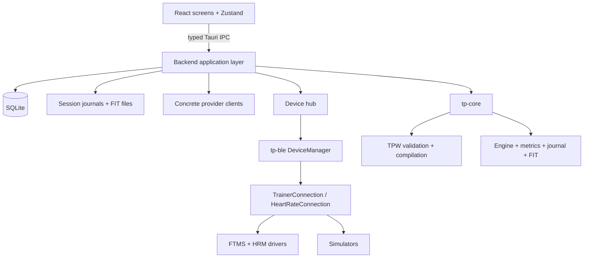
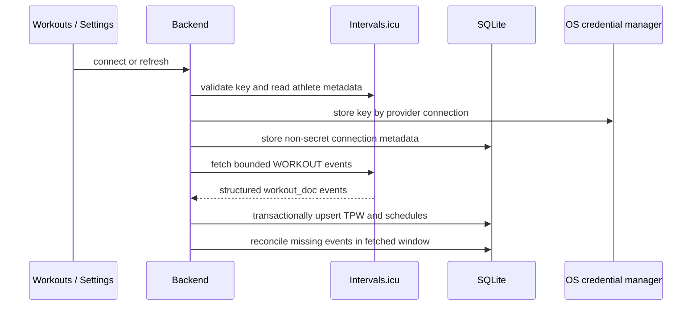

# TrainerPro architecture

**Purpose:** Define current technical ownership, dependency boundaries, and
major data flows. **Audience:** Engineers changing application structure or
cross-component behavior.

Observable behavior belongs in [SPEC.md](SPEC.md); the normative workout format
is [TPW/1](TPW.md).

## System map



The frontend presents state and user intent. The backend owns I/O, clocks,
credentials, persistence, provider requests, runtime orchestration, and Tauri
events. Domain calculations remain below those boundaries.

## Ownership boundaries

### `tp-core`

`tp-core` is deterministic and pure: no I/O, async runtime, BLE, Tauri, or
wall-clock access. It owns:

- TPW validation and compilation;
- executable workout and target calculations;
- the workout engine state machine and effects;
- journal parsing and aggregation;
- NP, IF, TSS, zones, and related metrics; and
- FIT encoding.

### `tp-ble`

`tp-ble` owns transport behavior. `DeviceManager` serializes adapter
initialization, scanning, scan cancellation, and connection setup. Hardware is
exposed only through `TrainerConnection` and `HeartRateConnection`; simulators
implement the same contracts.

The application-level `Trainer` and `HeartRateMonitor` are stable role owners.
They replace connection objects during recovery while consumers retain their
status and measurement subscriptions. Ownership of an object is not proof of a
live transport; `DeviceStatus` is the connectivity source of truth.

### Backend application layer

The backend owns Tauri commands and events, the player runtime, provider
clients, credential access, SQLite data modules, source caches, and activity
artifacts. SQL remains in focused `database` modules rather than IPC commands
or provider code.

### Frontend

The React frontend owns presentation and transient interaction state. It
hydrates through commands and receives ongoing runtime/device state through
events rather than polling. Rust serialization and `frontend/ipc.ts` form one
interface and change together.

## Workout and ownership model

SQLite is authoritative for normalized workout definitions, schedules,
provider connections, and Activities. TPW JSON is the stored semantic workout
definition. ZWO, ERG, MRC, and provider payloads are adapters at system
boundaries.

The main lifecycle is:

```text
WorkoutDefinition
    -> validate, compile, and snapshot
ExecutableWorkout
    -> execute
WorkoutSession
    -> record and finalize
Activity
```

A ScheduledWorkout references a WorkoutDefinition but owns placement and
provider identity separately. Provider-scheduled definitions are executable
cache entries, excluded from local Library listing and deduplication. A local
clone has a separate identity and lifecycle.

## Source normalization

Local files, WorkoutPlanner ZWO, What's on Zwift models, and Intervals.icu
`workout_doc` all normalize into `WorkoutDefinition`. The shared compiler then
produces the flat executable shape required by the trainer engine.

Library sources use the existing descriptor registry because they share a real
UI/configuration consumer. Scheduled-workout sync does not use that registry:
it has provider connection identity, bounded reconciliation, remote revisions,
and disconnect semantics that library browsing does not.

## Next Up and provider sync

Next Up is computed, never persisted. The backend combines active scheduled
workouts with recommendations derived from Activity history. SQLite supplies
cached results before any provider refresh.

Intervals.icu uses a concrete inbound pipeline:



Mapping completes before persistence. A failed request cannot erase cached
data. Repeated sync preserves local identities. Remote edits update the linked
definition and placement; missing events and disconnects soft-retire provider
state while retaining Activity references.

## Device and player flow

The hub starts stable Trainer and HRM owners. Foreground scans and connection
setup coordinate through `DeviceManager`; established links then operate
concurrently. Adapter disconnect events drive connection replacement and
status transitions.

The player runtime wraps the pure engine. It owns periodic ticks, trainer
effects, keep-alive, measurement aggregation, reconnect policy, journal writes,
and Tauri events. A trainer-control failure pauses execution; recovery reapplies
control and targets but waits for explicit resume. HRM failures affect only the
heart-rate path.

## Session and Activity flow

Starting creates a session ID and snapshots the TPW definition. Runtime samples
and control events append to a crash-safe JSONL journal. Ending replays the
journal, computes summaries and laps, writes FIT, and inserts the Activity in
one application flow. Activities retain the snapshot and optional schedule
identity so later edits or provider disconnects cannot rewrite history.

## Architectural decisions

- Tauri and Rust keep domain and device behavior shared across desktop shells.
- FTMS is the trainer-control protocol; legacy vendor protocols remain demand
  driven.
- SQLite is the structured source of truth; journals and FIT remain appropriate
  durable Activity artifacts.
- Journal-first recording prevents a process crash from destroying an entire
  ride and makes final FIT summaries deterministic.
- Provider abstractions are introduced only around demonstrated shared
  ownership or behavior, not speculative symmetry.
