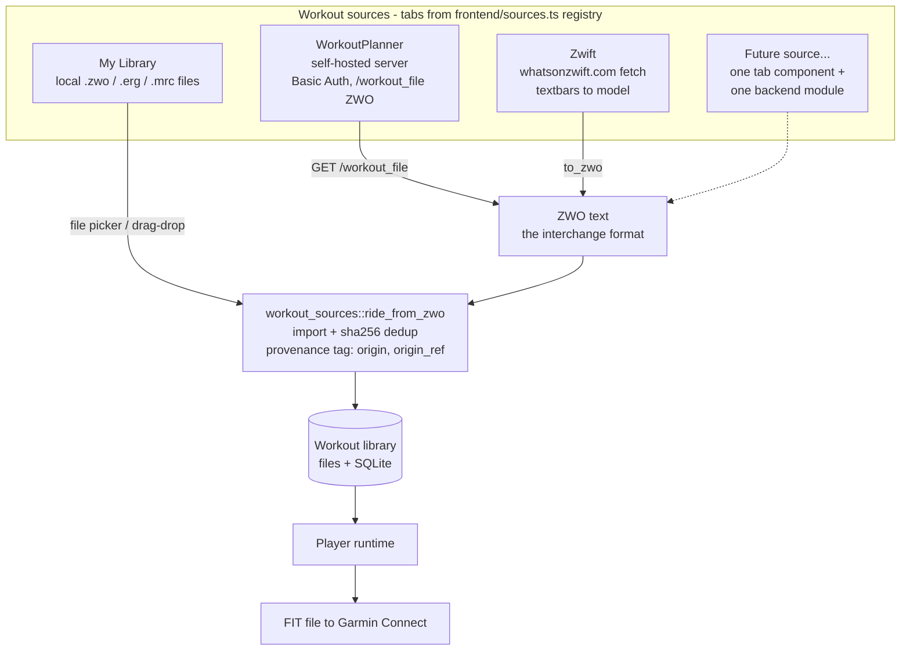
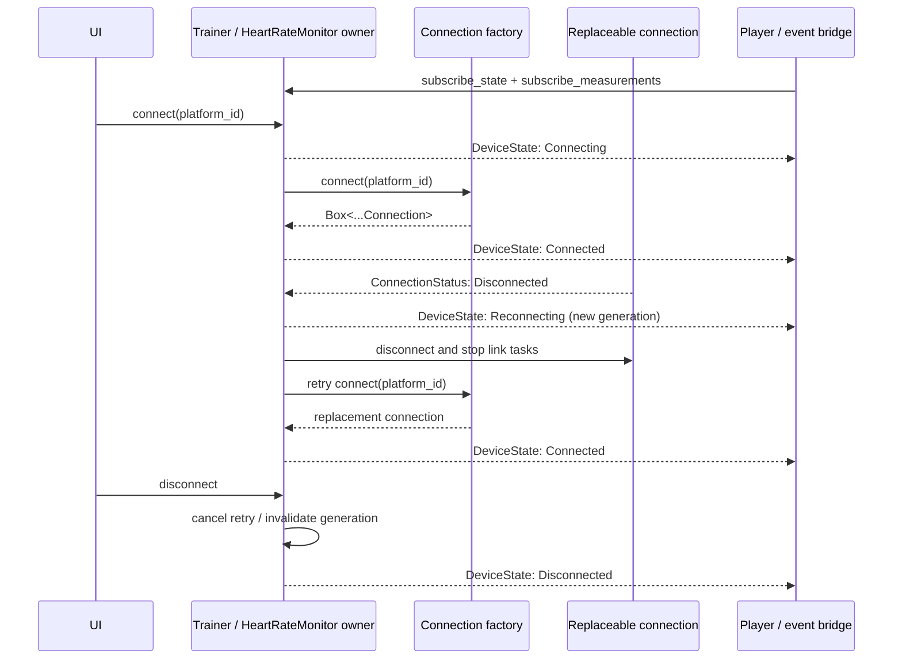

# Architecture notes

Companion diagrams to the overview in the [README](../README.md). The full
build spec is [`SPEC.md`](SPEC.md); design rationale and rejected alternatives
are in [`ALTERNATIVES.md`](ALTERNATIVES.md).

## Workout source plugin interface

Workout providers are plugins around one interchange format: **ZWO**. A source
either *is* a ZWO file (local import), *serves* ZWO (WorkoutPlanner), or
*builds a workout model and serializes it* with tp-core's ZWO writer
(whatsonzwift). Every source funnels into the same pipeline — none of them
touch import, database, or player code directly.

Adding a source = one frontend tab component registered in `frontend/sources.ts`,
plus a backend module that produces ZWO text and calls
`workout_sources::ride_from_zwo`. Provenance columns (`origin`, `origin_ref`) tag
imported rows so the library shows badges and future features (results
push-back, re-sync) know where a workout came from.

## Device connection lifecycle

`Trainer` and `HeartRateMonitor` are stable backend owners. A BLE or simulated
driver implements the corresponding one-link connection trait. Connection
replacement and retry state stay private to the owner, so the player and UI
subscribe once and never receive an optional connection object.

`tp-ble::DeviceManager` owns adapter-level scan and connection coordination.
Public and targeted scans are serialized. Startup uses one scan for all
configured physical roles and begins each device's setup as soon as it is
resolved. Discovery of the other role may continue, and resolved GATT setups
may proceed concurrently. Established links operate concurrently. A foreground
connection cancels public discovery, while an automatic retry waits for it. A
saved HRM lookup is preemptible by trainer recovery. The application hub chooses
when to scan or connect without implementing Bluetooth quiescence itself.

Trainer and heart-rate owners remain separate even though this lifecycle is
similar: trainer loss pauses a ride, while heart-rate loss only clears the
heart-rate measurement.

## Ride data flow

## Voice command flow

The frontend voice controller is the single lifecycle owner for permission,
capture, routing state, and feedback. Audio and synchronous Moonshine work stay
off the React thread. One screen-owned voice surface is active at a time. The
semantic worker returns only an intent match; it cannot parse application
arguments, invoke Tauri commands, or mutate application state.

```mermaid
flowchart LR
    MIC["System-default microphone"]
    CAP["WebAudio capture"]
    STT["Moonshine STT worker<br/>resampling + VAD + transcription"]
    ROUTE["Semantic routing worker<br/>active surface catalog"]
    GATE["Screen-owned command registry<br/>slots + live validation"]
    PLAYER["Existing typed player IPC"]
    FEEDBACK["Voice status + nonverbal cue"]

    MIC --> CAP --> STT
    STT -->|completed transcript only| ROUTE
    ROUTE -->|zero or one intent match| GATE
    GATE -->|valid Player action| PLAYER
    PLAYER --> FEEDBACK
```

The full Player and shared voice-control catalogs participate in semantic
matching, then the registries reject commands unavailable in the current state.
This ordering keeps an unavailable command from being reinterpreted as a
different available one. “Stop listening” or “stop talking” sets a session-only
controller gate: capture and both models remain active, but every Player command
is ignored until “resume listening” or an alias wins. The persistent setting is
still the hard disable. Every other screen, including the Builder, suspends
voice. Unmatched speech has no effect. No voice route can finish a ride;
end-like language resolves to the existing pause action and tells the rider to
finish manually.
`frontend/voice/VoiceController.tsx` owns the production lifecycle, generic
routing contracts live under `frontend/voice`, and
`frontend/screens/Player.voice.ts` declares each Player command once with its
phrases, phase availability, slot preparation, and execution. Shared registry
machinery derives the catalog and dispatch table; bounded numeric slot parsing
is independent of semantic matching. `frontend/voice/voiceControls.ts` owns the
cross-screen suspension commands, and `voiceRouting.ts` composes and gates the
registries. A future screen adds an adjacent
`.voice.ts` surface; it does not add screen logic to the semantic worker.
Changing surface identity invalidates in-flight work even when voice remains
active across the navigation.

## Cross-platform status

| Layer | macOS (shipped) | Windows (planned) | Shared? |
|---|---|---|---|
| Shell / webview | WKWebView | WebView2 (bootstrapper via NSIS) | Tauri 2 config |
| BLE | CoreBluetooth via btleplug | WinRT via btleplug | drivers + traits unchanged |
| Everything else | — | — | 100 % shared (tp-core, backend, frontend) |

Windows-specific work is validation, not architecture: btleplug's WinRT
backend has its own timing personality (the CoreBluetooth race-guards we
carry — scan quiescing, serialized connects — are kept on both platforms),
peripheral IDs are per-machine on both OSes, and installers need
`bundle.active` + signing decisions. The full test suite (all hardware-free)
runs identically on both platforms.
