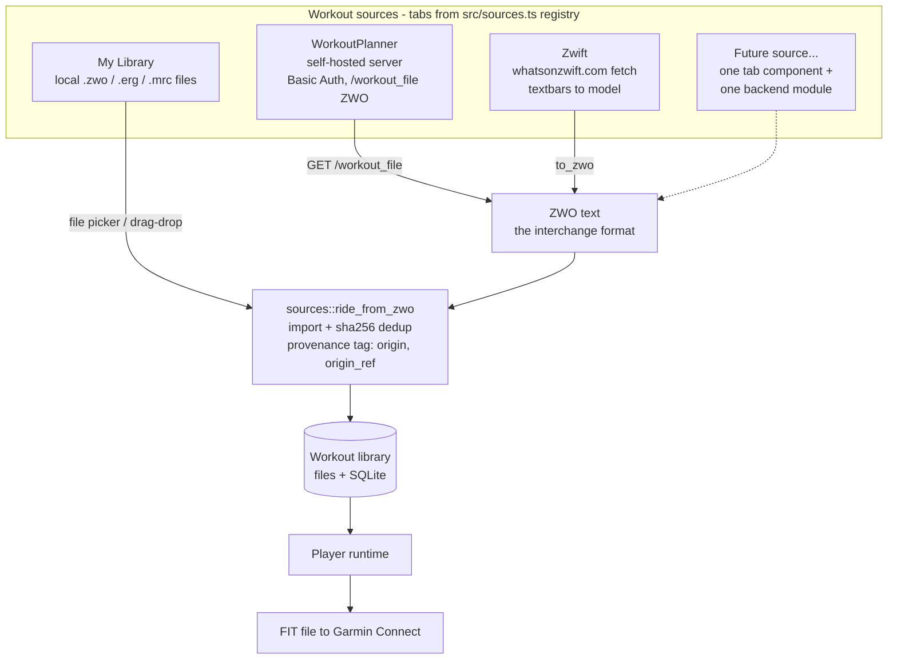
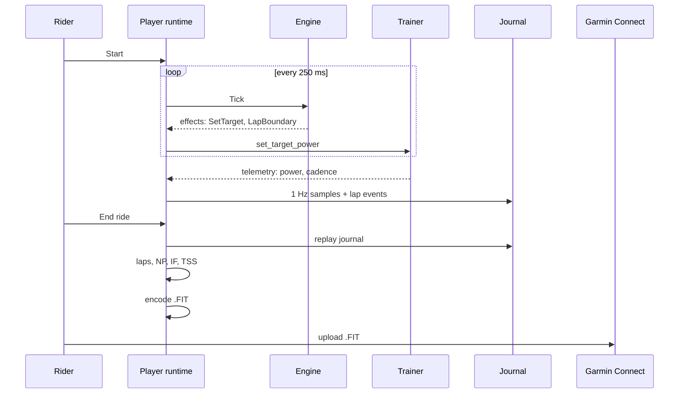

# Architecture notes

Companion diagrams to the overview in the [README](../README.md). The full
build spec is [`SPEC.md`](SPEC.md); design rationale and rejected alternatives
are in [`ALTERNATIVES.md`](ALTERNATIVES.md).

## Workout source plugin interface

Workout providers are plugins around one interchange format: **ZWO**. A source
either *is* a ZWO file (local import), *serves* ZWO (WorkoutPlanner), or
*builds a workout model and serializes it* with tp-core's ZWO writer
(whatsonzwift). Every source funnels into the same pipeline — none of them
touch import, database, or player code directly.

Adding a source = one frontend tab component registered in `src/sources.ts`,
plus a backend module that produces ZWO text and calls
`sources::ride_from_zwo`. Provenance columns (`origin`, `origin_ref`) tag
imported rows so the library shows badges and future features (results
push-back, re-sync) know where a workout came from.

## Ride data flow

## Cross-platform status

| Layer | macOS (shipped) | Windows (planned) | Shared? |
|---|---|---|---|
| Shell / webview | WKWebView | WebView2 (bootstrapper via NSIS) | Tauri 2 config |
| BLE | CoreBluetooth via btleplug | WinRT via btleplug | drivers + traits unchanged |
| Everything else | — | — | 100 % shared (tp-core, tp-app, frontend) |

Windows-specific work is validation, not architecture: btleplug's WinRT
backend has its own timing personality (the CoreBluetooth race-guards we
carry — scan quiescing, serialized connects — are kept on both platforms),
peripheral IDs are per-machine on both OSes, and installers need
`bundle.active` + signing decisions. The full test suite (all hardware-free)
runs identically on both platforms.
