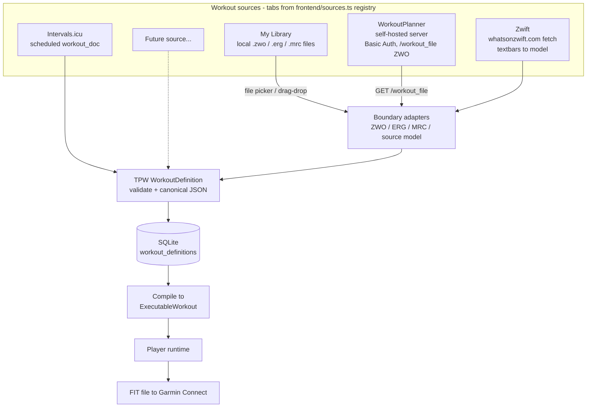
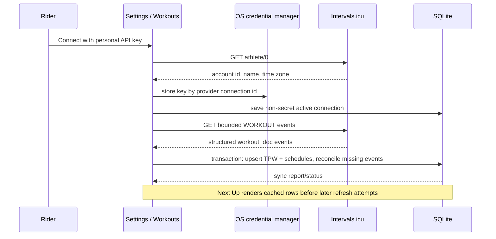
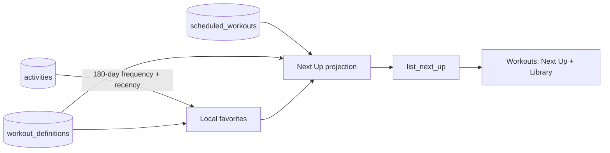
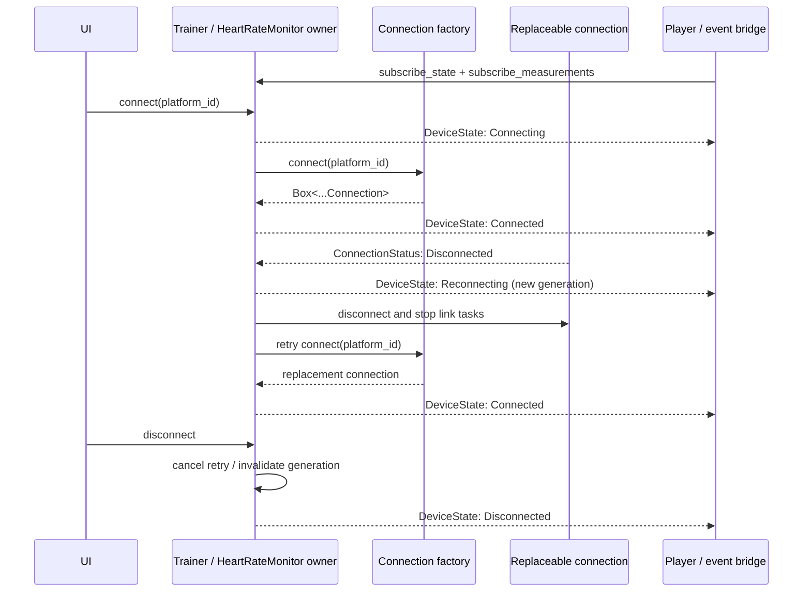
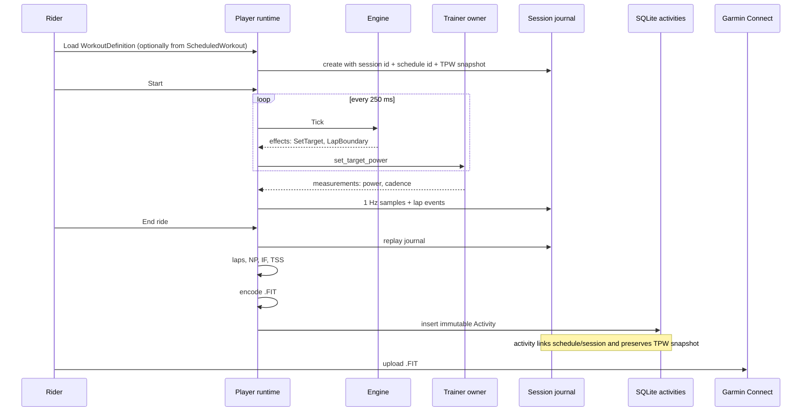

# Architecture notes

Companion diagrams to the overview in the [README](../README.md). The full
build spec is [`SPEC.md`](SPEC.md); design rationale and rejected alternatives
are in [`ALTERNATIVES.md`](ALTERNATIVES.md).

> **Scope:** this document describes current implemented flows. The accepted
> connected-workout target architecture is in
> [`workout-platform.md`](workout-platform.md), and the product behavior it
> serves is in [`PRODUCT.md`](PRODUCT.md).

## Workout source normalization

Workout sources normalize into **TrainerPro Workout (TPW)** before persistence.
Local ZWO/ERG/MRC files and WorkoutPlanner's ZWO response are boundary payloads;
What's on Zwift already builds a semantic model, and Intervals.icu maps its
structured `workout_doc` directly. None becomes workout identity.

Adding a source = one frontend tab component registered in `frontend/sources.ts`,
plus a backend module that produces `WorkoutDefinition` or maps its supported
payload through a boundary adapter. Provenance columns (`origin`, `origin_ref`)
remain the current source badges. Intervals.icu schedules additionally carry a
provider connection, external event identity/revision, and sync timestamps.

## Intervals.icu inbound sync

The first connected-provider path is deliberately concrete. It does not turn
the older workout-library registry into a connector framework.

One Intervals.icu account can be active at a time. The refresh boundary covers
7 days behind and 42 days ahead of the athlete-local date. Provider mapping and
database reconciliation happen only after a complete HTTP response; fetch
failure cannot erase cached data. Disconnect removes the vault credential and
soft-removes active provider schedules/definitions in one database transaction,
preserving Activity links and historical rows.

Definitions owned by provider schedules remain executable through Next Up but
are excluded from the local Library and its TPW deduplication boundary. An
identical local import therefore creates an independently owned copy that is
not retired by provider reconciliation or disconnect.

## Next Up projection and Workouts surface

The Workouts screen leads with a horizontal Next Up rail and keeps the Library
below it. The backend assembles the scheduled and recommended entries; the
frontend presents the full ordered result without turning it into a calendar.

Scheduled rows are calendar-local placements over a WorkoutDefinition. Active,
unfulfilled rows from the preceding seven calendar days onward appear first in
date/time order; older missed rows remain stored but leave this projection.
Recommendations follow, are computed rather than persisted, and exclude
definitions already scheduled in the projection.
The backend derives the current calendar date from the active planning
authority's stored IANA time zone, falling back to the machine-local zone when
no planning authority is connected.
Starting a scheduled item carries its schedule identity into the session
journal and resulting Activity.

## Device connection lifecycle

`Trainer` and `HeartRateMonitor` are stable backend owners. A BLE or simulated
driver implements the corresponding one-link connection trait. Connection
replacement and retry state stay private to the owner, so the player and UI
subscribe once and never receive an optional connection object.

`tp-ble::DeviceManager` owns adapter-level scan and connection coordination.
Public and targeted scans are serialized. Startup uses one scan for all
configured physical roles and begins each device's setup as soon as it is
resolved. Discovery of the other role may continue, and resolved GATT setups
may proceed concurrently. Established links operate concurrently. A foreground
connection cancels public discovery, while an automatic retry waits for it. A
saved HRM lookup is preemptible by trainer recovery. The application hub chooses
when to scan or connect without implementing Bluetooth quiescence itself.

Trainer and heart-rate owners remain separate even though this lifecycle is
similar: trainer loss pauses a ride, while heart-rate loss only clears the
heart-rate measurement.

## Workout session to activity flow

## Cross-platform status

| Layer | macOS (shipped) | Windows (planned) | Shared? |
|---|---|---|---|
| Shell / webview | WKWebView | WebView2 (bootstrapper via NSIS) | Tauri 2 config |
| BLE | CoreBluetooth via btleplug | WinRT via btleplug | drivers + traits unchanged |
| Everything else | — | — | 100 % shared (tp-core, backend, frontend) |

Windows-specific work is validation, not architecture: btleplug's WinRT
backend has its own timing personality (the CoreBluetooth race-guards we
carry — scan quiescing, serialized connects — are kept on both platforms),
peripheral IDs are per-machine on both OSes, and installers need
`bundle.active` + signing decisions. The full test suite (all hardware-free)
runs identically on both platforms.
