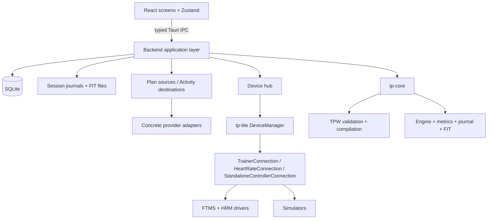
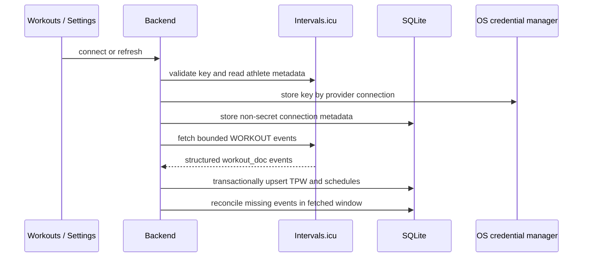

# TrainerPro architecture

**Purpose:** Define current technical ownership, dependency boundaries, and
major data flows. **Audience:** Engineers changing application structure or
cross-component behavior.

Observable behavior belongs in [SPEC.md](SPEC.md); the normative workout format
is [TPW/1](TPW.md).

## System map


```mermaid
flowchart TD
    UI[React screens + Zustand] -->|typed Tauri IPC| APP[Backend application layer]
    APP --> DB[(SQLite)]
    APP --> FILES[Session journals + FIT files]
    APP --> CAPABILITIES[Plan sources / Activity destinations]
    CAPABILITIES --> PROVIDERS[Concrete provider adapters]
    APP --> CORE[tp-core]
    APP --> HUB[Device hub]
    HUB --> MANAGER[tp-ble DeviceManager]
    MANAGER --> TRAITS[TrainerConnection / HeartRateConnection / StandaloneControllerConnection]
    TRAITS --> BLE[FTMS + HRM drivers]
    TRAITS --> SIM[Simulators]
    CORE --> TPW[TPW validation + compilation]
    CORE --> ENGINE[Engine + metrics + journal + FIT]
```

The frontend presents state and user intent. The backend owns I/O, clocks,
credentials, persistence, provider requests, runtime orchestration, and Tauri
events. Domain calculations remain below those boundaries.

## Ownership boundaries

### `tp-core`

`tp-core` is deterministic and pure: no I/O, async runtime, BLE, Tauri, or
wall-clock access. It owns:

- TPW validation and compilation;
- executable workout and target calculations;
- the workout engine state machine and effects;
- journal parsing and aggregation;
- NP, IF, TSS, zones, and related metrics;
- flat-road motion integration and replay for estimated speed/distance; and
- FIT encoding.

### `tp-ble`

`tp-ble` owns transport behavior. `DeviceManager` serializes adapter
initialization, scanning, scan cancellation, and connection setup. Hardware is
exposed through `TrainerConnection`, `HeartRateConnection`, and
`StandaloneControllerConnection`; simulators implement the same contracts.

The application-level `Trainer` and `HeartRateMonitor` are stable role owners.
They replace connection objects during recovery while consumers retain their
status and measurement subscriptions. Ownership of an object is not proof of a
live transport; `DeviceStatus` is the connectivity source of truth.

The Controller owner selects trainer controls or a paired standalone controller
connection. Wahoo input is an optional capability of the existing FTMS connection
and its notification pump; the Controller never owns or retries that peripheral.
Ride owns its direct BLE protocol lifecycle. Both produce physical button edges;
application mappings stay in the Player. Source metadata and connectivity travel
through the existing owner state stream; transient input carries its generation.
Input discontinuities cancel holds rather than synthesizing releases.

### Backend application layer

The backend owns Tauri commands and events, the player runtime, provider
clients, credential access, SQLite data modules, source caches, and activity
artifacts. SQL remains in focused `database` modules rather than IPC commands
or provider code.

### Frontend

The React frontend owns presentation and transient interaction state. It
hydrates through commands and receives ongoing runtime/device state through
events rather than polling. Rust serialization and `frontend/ipc.ts` form one
interface and change together.

## Workout and ownership model

SQLite is authoritative for normalized workout definitions, schedules,
provider connections, and Activities. TPW JSON is the stored semantic workout
definition. ZWO, ERG, MRC, and provider payloads are adapters at system
boundaries.

The main lifecycle is:

```text
WorkoutDefinition
    -> validate, compile, and snapshot
ExecutableWorkout
    -> execute
WorkoutSession
    -> record and finalize
Activity
```

A ScheduledWorkout references a WorkoutDefinition but owns placement and
provider identity separately. Provider-scheduled definitions are executable
cache entries, excluded from local Library listing and deduplication. A local
clone has a separate identity and lifecycle.

## Source normalization

Local files, WorkoutPlanner ZWO, What's on Zwift models, and Intervals.icu
`workout_doc` all normalize into `WorkoutDefinition`. The shared compiler then
produces the flat executable shape required by the trainer engine.

Library sources use the existing descriptor registry because they share a real
UI/configuration consumer. Scheduled-workout sync does not use that registry:
it has provider connection identity, bounded reconciliation, remote revisions,
and disconnect semantics that library browsing does not.

## Provider capabilities

The backend capability dispatcher owns the provider catalog, connection views,
capability validation, and application operations. Connections can supply plans,
receive Activities, or both. The frontend consumes that catalog; only the
sign-in forms bind to provider-specific authentication commands. Library sources
retain their separate descriptor registry.

Authentication, remote payload mapping, and transport behavior remain in
concrete adapters. Account mutations and capability operations share one guard
per provider, so different providers remain independent. Garmin's pending MFA
state has its own transient owner, while SQLite and the OS vault own durable
account metadata and credentials. Authentication state is not a network probe.

The Activity transfer flow resolves the immutable FIT artifact, checks for an
existing account-scoped receipt, invokes the destination adapter, and records
only a confirmed remote Activity ID. Uploads and local deletion share a transfer
guard, acquired before a provider guard. Receipt persistence survives account
reconnection; local Activity deletion cascades only local receipts.

## Next Up and provider sync

Next Up is computed, never persisted. The backend combines active scheduled
workouts with recommendations derived from Activity history. SQLite supplies
cached results before any provider refresh. Each source refresh reports its own
outcome. Date windows are computed in the backend from that source's time zone;
Next Up projects each schedule using its placement zone, owning account zone,
or machine-local fallback.

Intervals.icu uses a concrete inbound pipeline:


```mermaid
sequenceDiagram
    participant UI as Workouts / Settings
    participant APP as Backend
    participant API as Intervals.icu
    participant DB as SQLite
    participant Vault as OS credential manager

    UI->>APP: connect or refresh
    APP->>API: validate key and read athlete metadata
    APP->>Vault: store key by provider connection
    APP->>DB: store non-secret connection metadata
    APP->>API: fetch bounded WORKOUT events
    API-->>APP: structured workout_doc events
    APP->>DB: transactionally upsert TPW and schedules
    APP->>DB: reconcile missing events in fetched window
```

Mapping completes before persistence. A failed request cannot erase cached
data. Repeated sync preserves local identities. Remote edits update the linked
definition and placement; missing events and disconnects soft-retire provider
state while retaining Activity references.

## Device and player flow

The hub starts stable Trainer and HRM owners. Foreground scans and connection
setup coordinate through `DeviceManager`; established links then operate
concurrently. Adapter disconnect events drive connection replacement and
status transitions.

The player runtime wraps the pure engine. It owns periodic ticks, trainer
effects, keep-alive, measurement aggregation, reconnect policy, journal writes,
and Tauri events. A trainer-control failure pauses execution; recovery reapplies
control and targets but waits for explicit resume. HRM failures affect only the
heart-rate path.

## Session and Activity flow

Starting creates a session ID and snapshots the TPW definition. Runtime samples
and control events append to a crash-safe JSONL journal. Ending replays the
journal, computes summaries, activity segments, and an optional motion trace,
writes FIT, and inserts the Activity in one application flow. Activities retain
the snapshot and optional schedule identity so later edits or provider disconnects
cannot rewrite history.

Motion replay uses the journal's snapshotted distance preference and rider weight.
The pure motion calculation owns energy and accumulated distance; speed is derived
from energy. FIT serialization consumes the shared trace for records, activity
segments, and session totals.
Recording skips missed timer ticks, while replay bounds sample duration to avoid
crediting overlapping time in older or delayed recordings.

Domain terms are defined in the [product vocabulary](PRODUCT.md#vocabulary).

## Architectural decisions

- Tauri and Rust keep domain and device behavior shared across desktop shells.
- FTMS is the trainer-control protocol; legacy vendor protocols remain demand
  driven.
- SQLite is the structured source of truth; journals and FIT remain appropriate
  durable Activity artifacts.
- Journal-first recording prevents a process crash from destroying an entire
  ride and makes final FIT summaries deterministic.
- Provider abstractions are introduced only around demonstrated shared
  ownership or behavior, not speculative symmetry.

## Local workout voice

VoiceController owns permission, capture, model lifecycle, routing, and feedback.
WorkerMicTranscriber sends mono WebAudio samples to the bundled Moonshine worker;
a separate EmbeddingGemma worker matches phrases. Player.voice.ts owns command
phrases, availability, bounded arguments, and live-state validation. Shared
Player actions give pointer and voice commands consistent timeline representation
and use the existing IPC; workers cannot execute application actions.

The full registered catalog is matched before availability is checked, so an
unavailable command is not reinterpreted as another available action. Numeric
arguments are parsed deterministically, and prepared commands re-read live state.
Capture and semantic requests are serialized without an utterance queue.

Capture and routing generations invalidate stale results after visibility,
permission, or device changes, and after keyboard focus loss for keyboard holds. Only completed transcripts are routed. Local models are
bundled for offline use; microphone tracks and models are released on hard disable.
Leaving the Player stops capture while retaining warm models. Pipeline tracing
records lifecycle and dispatch boundaries, never audio or transcript content.
See [the voice implementation guide](../frontend/voice/README.md) for details.

The pure workout engine consumes EngineEvent values, including runtime-supplied
clock ticks, and returns EngineAction directives. The runtime performs trainer,
recording, and UI effects. Segment finalization distinguishes completion from
skip so the timeline and recording share the same transition source.

Push-to-talk is owned by the existing voice provider and lifecycle reducer.
Keyboard and controller edges invoke the same begin/finish/cancel operations.
Model preparation does not open capture. Finish closes microphone input before
flushing the speech worker, retains final line revisions, and routes the combined
utterance once. Cancel invalidates the generation before closing the stream and
discards late callbacks. Controller holds permit an unfocused visible Player;
keyboard holds cancel on blur. Neither capture nor pending interpretation survives
leaving the Player, hiding the window, or loss of its initiating input.

## Garmin Activity upload

The backend Garmin client owns mobile SSO, MFA, token refresh, and the Connect
upload protocol. Pending MFA cookies are transient; tokens live in the
bundle-scoped OS credential vault. The shared capability layer coordinates
account operations and Activity transfers.

The Garmin adapter refreshes and persists credentials when needed, sends one
multipart upload, and checks asynchronous completion without resending the FIT.
It returns a confirmed remote Activity ID to the shared transfer flow. Uncertain responses remain visible
failures requiring the user to check Garmin before retrying. Recording and
ride finalization do not depend on Garmin availability.
