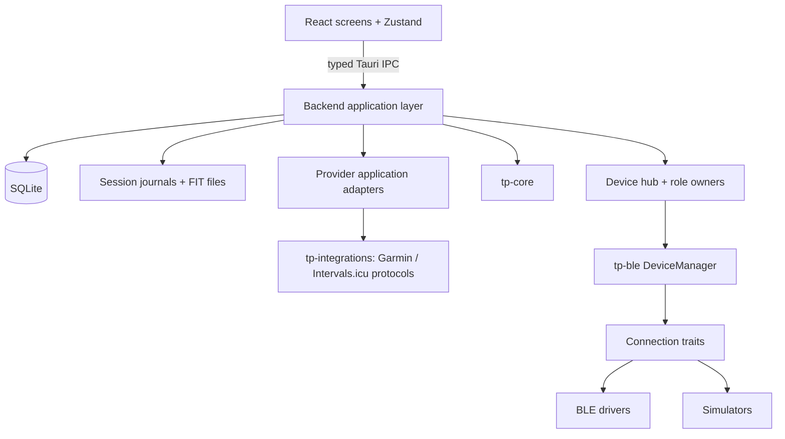

# TrainerPro architecture

**Purpose:** Define technical ownership, dependency boundaries, and major flows. **Audience:** Engineers changing application structure or cross-component behavior.

Observable behavior belongs in [SPEC.md](SPEC.md), product vocabulary and direction
in [PRODUCT.md](PRODUCT.md), and the workout format in [TPW/1](TPW.md).

## System map


```mermaid
flowchart TD
    UI[React screens + Zustand] -->|typed Tauri IPC| APP[Backend application layer]
    APP --> DB[(SQLite)]
    APP --> FILES[Session journals + FIT files]
    APP --> ADAPTERS[Provider application adapters]
    ADAPTERS --> INTEGRATIONS[tp-integrations: Garmin / Intervals.icu protocols]
    APP --> CORE[tp-core]
    APP --> HUB[Device hub + role owners]
    HUB --> MANAGER[tp-ble DeviceManager]
    MANAGER --> CONNECTIONS[Connection traits]
    CONNECTIONS --> BLE[BLE drivers]
    CONNECTIONS --> SIM[Simulators]
```

## Ownership boundaries

- **`tp-core`** owns TPW validation/compilation, the workout engine, journal replay,
  metrics, motion calculation, and FIT encoding. It is deterministic and pure:
  no I/O, async runtime, BLE, Tauri, or wall-clock access.
- **`tp-ble`** owns transport contracts, drivers, scanning, and simulators.
  `DeviceManager` serializes adapter initialization, scan cancellation, and
  connection setup. Established links operate concurrently.
- **`tp-integrations`** owns concrete Garmin and Intervals.icu HTTP clients,
  provider payloads, and protocol errors. It has no dependency on TrainerPro's
  domain model, desktop shell, database, or credential vault.
- **Backend** owns Tauri commands/events, clocks, runtime orchestration, provider
  application adapters, credentials, persistence, and activity artifacts. SQL
  stays in focused `database` modules. TPW conversion, sync policy, and
  library-source clients remain here.
- **Frontend** owns presentation and transient interaction state. It hydrates
  through commands and receives ongoing state through events. Rust serialization
  and `frontend/ipc.ts` form one interface and change together.

## Workout ownership and persistence

SQLite is authoritative for workout definitions, schedules, provider connections,
source caches, and the Activity index. TPW JSON is the stored semantic definition;
ZWO, ERG, MRC, and provider payloads are boundary formats.

```text
WorkoutDefinition -> validate, compile, snapshot -> ExecutableWorkout
                  -> WorkoutSession -> record, finalize -> Activity
```

A ScheduledWorkout references a definition but owns placement and provider
identity separately. Provider-scheduled definitions are executable cache entries,
excluded from local Library listing and deduplication. Cloning creates an
independently owned local definition. Activities retain the workout snapshot and
optional schedule identity, so subsequent edits cannot rewrite history.

Library sources share a descriptor registry and normalize into
`WorkoutDefinition`. Scheduled sync has its own account identity, bounded
reconciliation, and disconnect lifecycle; it does not use that registry.

## Provider operations

The backend capability dispatcher owns the provider catalog, connection views,
capability validation, and application operations. The frontend consumes this
catalog; sign-in forms bind to provider-specific authentication commands.

Clients own authentication protocols and transport. Backend adapters convert
provider data, persist credentials, and coordinate accounts. Account mutations
and capability operations share one guard per provider. Garmin's pending MFA
challenge has a transient owner; SQLite and the bundle-scoped OS vault hold
account metadata and credentials. Authentication state is not a network probe.

Activity transfer resolves the immutable FIT artifact, checks the account-scoped
receipt, invokes the destination, and records only a confirmed remote Activity ID.
Uploads and local deletion share a transfer guard, acquired before the provider
guard. Reconnection preserves receipts; local deletion cascades only local receipts.

The backend persists rotated Garmin tokens before uploading. Recording and
finalization do not depend on provider availability. Upload behavior belongs in
[Integrations](integrations.md#garmin-connect).

## Next Up and schedule sync

Next Up is computed from active schedules and Activity-derived recommendations,
never persisted. Cached results are available before refresh, and each source
reports its own outcome. Refresh windows use the account time zone; schedule
projection uses placement zone, then account zone, then machine-local fallback.

Intervals.icu fetches a bounded calendar window through `tp-integrations`. The
backend maps structured workouts to TPW before transactionally updating definitions
and schedules. External event identity is scoped to the provider connection.
Reconciliation and cache behavior belong in [Integrations](integrations.md#intervalsicu).

## Devices and player

`TrainerConnection`, `HeartRateConnection`, and `StandaloneControllerConnection`
separate hardware from application policy; simulators implement the same contracts.
Stable Trainer and HRM role owners manage reconnect policy and replace connections
while consumers retain their state and measurement subscriptions. A retained
object does not prove connectivity: `DeviceStatus` is authoritative, driven by
adapter disconnect events for BLE link loss.

The Controller selects borrowed trainer controls or an owned standalone connection.
Wahoo input uses the FTMS notification pump; the Controller never owns or retries
that peripheral. Ride owns its direct BLE lifecycle. Source metadata travels in
the owner state stream; transient input carries its generation. Discontinuities
cancel holds rather than synthesizing releases. Button mappings stay in the Player.

The pure engine consumes runtime-supplied events and returns actions. The runtime
owns ticks, trainer effects, keep-alive, measurement aggregation, journal writes,
and UI events. Trainer-control failure pauses execution; recovery
reapplies control and targets but requires explicit resume. HRM failure affects
only heart-rate data. Segment finalization distinguishes completion from skip so
recording and the timeline share one transition source.

## Recording and Activity finalization

Loading the Player creates a session ID and snapshots the workout. Samples and
control events append to a crash-safe JSONL journal. Ending replays it, computes
summaries and activity segments, writes FIT, and inserts the Activity.
Journal-first recording preserves recovery and deterministic finalization.

Motion replay uses the snapshotted distance preference and rider weight. The pure
calculation owns energy and accumulated distance; speed derives from energy.
FIT records, laps, and session totals consume one shared motion trace. Recording
skips missed ticks; replay bounds sample durations to prevent overlapping credit.

## Local workout voice

VoiceController owns permission, capture, model lifecycle, routing, and feedback.
Bundled workers transcribe and match phrases; they cannot execute application
commands. Player actions are shared by pointer, keyboard, controller, and voice.
Matching precedes availability checks, and prepared actions revalidate live state.
Numeric arguments are parsed deterministically. Capture and semantic requests are
serialized without an utterance queue.

Capture and routing generations reject stale results after permission, visibility,
focus, or input changes. Finish closes capture before flushing; cancel invalidates
the generation and discards late callbacks. Leaving or hiding the Player cancels
work; hard disable releases microphone and models.
Tracing records lifecycle boundaries, never audio or transcripts. Implementation
entry points and QA workflows are in [the voice guide](voice.md).
