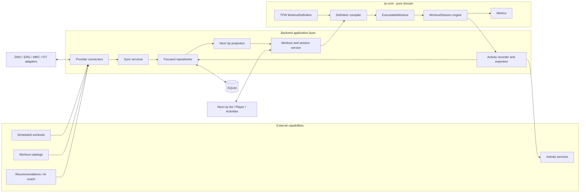

# Connected workout platform — target software design

Status: target architecture and delivery plan. This document translates the
product decisions in [`PRODUCT.md`](PRODUCT.md) into software boundaries. It is
not a claim that the current code already has these types or tables. Current
flows remain documented in [`architecture.md`](architecture.md) and
[`SPEC.md`](SPEC.md) until each migration PR lands.

## Target flow

The arrows show ownership direction, not a mandate for one large provider
interface. A connector uses only the capabilities its external service
actually supports.

## Responsibilities

### `tp-core`

Keep `tp-core` pure: no database, files, network, clocks, async, BLE, or Tauri.
It owns:

- the versioned semantic WorkoutDefinition types;
- validation and normalization that require no I/O;
- conversion from WorkoutDefinition to ExecutableWorkout;
- the deterministic workout-session state machine;
- workout/activity metrics; and
- pure parsers or serializers where a boundary format remains useful.

The current crate should not be renamed to `WorkoutSession`, and this program
does not justify a new crate by itself. A later split requires a demonstrated
ownership or dependency boundary.

### Backend application layer

The backend owns:

- SQLite migrations and focused repositories;
- provider authentication, clients, capability declarations, and sync policy;
- mapping provider objects to and from domain objects;
- orchestration of Next Up, workout loading, sessions, recording, and activity
  publication; and
- filesystem artifacts required for crash recovery or external exchange.

Tauri commands should be thin application entry points. They should not contain
SQL or provider-specific normalization logic.

### Frontend

The frontend owns presentation and interaction:

- Next Up as the default vertically ordered list;
- compact scheduled date/time context and training-focus tags;
- workout inspection, clone-and-adjust interactions, and session controls;
- Activities and secondary Browse surfaces; and
- connection and sync-status UI.

The Rust serialized payloads and `frontend/ipc.ts` remain one API and change in
the same PR.

## Canonical workout representation

WorkoutDefinition is the in-code representation of TrainerPro Workout (TPW),
the versioned semantic JSON stored in SQLite. TPW/1 is specified in
[`TPW.md`](TPW.md) and supports only meaning with real consumers:

- sport and descriptive metadata;
- time-based steps;
- steady targets and target ranges;
- ramps;
- nested repetitions;
- power targets relative to FTP or in watts;
- cadence targets and coaching text; and
- a training-focus tag or provider label when available.

The sport-specific prescription boundary allows a later TPW version to add
running pace or speed and incline for treadmill control. Heart-rate,
open-duration, and other step semantics should enter the canonical model when
a selected provider or execution path needs them, not in a speculative
universal format.

Provider identity, remote revisions, schedule placement, recommendation rank,
and activity measurements do not belong inside WorkoutDefinition. They have
different lifecycles and ownership.

Every adapter needs fixtures that establish which semantics round-trip, which
are intentionally normalized, and which are unsupported. A provider-specific
payload may be retained as an inert snapshot, but the system must always know
which representation is authoritative.

## Persistence and SQL boundary

Raw SQL should be restricted to a backend database namespace with focused
modules for the behaviors that own it—for example definitions, schedules,
activities, provider connections/links, devices, settings, and sync state.
Commands and runtimes call concrete data-access functions. Do not introduce an
ORM, a generic repository trait, or a separate data crate without a real second
implementation or ownership boundary.

The conceptual storage model is:

| Stored concept | Important relationships and state |
|---|---|
| Workout definitions | TPW version, ownership, lifecycle timestamps |
| Scheduled workouts | Definition reference or provider snapshot, scheduled local date/time, provider link, remote revision, sync status |
| Activities | Optional definition/session/scheduled-workout references, start/end and summaries, recording/export locations, provider links |
| Provider connections | Provider kind, non-secret configuration, credential reference, enabled capabilities, sync status/cursor |
| Provider links | Local entity, provider connection, external identity/revision, last synchronized state |

Recommendations do not require their own table for the first local heuristic;
they can be computed as a read model from definitions and activities. Persist
or cache them only when an external recommender needs stable identity, expiry,
dismissal, or sync behavior.

SQLite is authoritative for workout definitions and application metadata.
Crash-safe append journals and generated FIT files may remain appropriate
activity artifacts; the activity is still the database entity. Whether final
sample streams eventually move into SQLite is a separate measured decision and
is not required to remove the workout-file dual truth.

## Next Up application model

The backend assembles Next Up from two semantically distinct sources:

1. scheduled workouts ordered by their schedule policy; and
2. recommendations ranked by the active recommender.

The serialized entries must preserve their kind because their available
actions differ. Scheduled items carry date/time, provider ownership, and sync
status. Recommendations carry a training-focus tag and recommendation
provenance; they do not need to expose the ranking rationale in P0.

Both entry types resolve to a WorkoutDefinition and use the same compile,
snapshot, load, and start path. Starting a recommendation does not create a
scheduled workout. Next Up itself is never written back to storage.

The initial local recommender should remain a small deterministic frequency
query or service over activity history. Avoid creating a general
recommendation framework until an external or AI recommender becomes the
second real consumer.

## Provider and sync model

Connectors declare only real capabilities such as schedule read/write, catalog
read, activity read/write, or recommendation read. Capability checks determine
UI and orchestration; unsupported operations remain absent.

Every synchronized object needs:

- a stable local identity independent of the provider ID;
- a scoped provider identity through its ProviderConnection;
- a remote revision or best available change token;
- the last successfully synchronized representation or digest needed for
  conflict detection; and
- observable clean, pending, failed, deleted, or conflict state where relevant.

Inbound sync is idempotent. Remote deletion is explicit rather than inferred
from a partial page. Outbound retries use stable external IDs or idempotency
keys where the provider supports them.

Provider-owned workout definitions are read-only locally except for
session-local adjustments. A durable edit creates a TrainerPro-owned clone.
Publishing that clone is explicit. When both sides changed since the last
successful sync, surface a conflict; structured workouts are not silently
field-merged.

The first release should prefer one active planning authority unless multi-
planner behavior is explicitly designed. Catalog and activity connections can
remain multiple and asymmetric.

## Session and activity boundary

At load/start time, compile and snapshot the definition with the athlete
parameters required for execution. The session retains the source scheduled or
recommendation identity for traceability but does not depend on a mutable
provider cache while riding.

The live player runtime continues to own clocks, BLE effects, sampling, and
crash recovery. The pure session engine continues to accept inputs and emit
effects. Finishing or abandoning a session produces an Activity when there is
recorded work worth retaining. FIT is generated from the activity recording as
an exchange artifact.

## Suggested pull-request sequence

The sequence favors reviewability and keeps behavior-preserving refactors away
from schema/product changes.

1. **Product documentation** — add the product, roadmap, and target-platform
   documents; mark superseded current-state decisions. No runtime changes.
2. **SQL ownership boundary** — move existing workout, ride, device, settings,
   and source-cache SQL behind focused database modules without changing the
   schema or UI. Characterize existing queries with tests first.
3. **Semantic workout domain** — add WorkoutDefinition and ExecutableWorkout
   naming/types, JSON versioning, validation, and a pure compiler in `tp-core`.
   Keep current parsers and engine working through adapters.
4. **Canonical workout persistence** — add the new SQLite representation and
   make load/create/import use it. Stop treating a ZWO/ERG/MRC path as workout
   identity. Backward compatibility is not a P0 gate; choose an explicit reset
   or narrow migration rather than indefinite dual writes.
5. **Activity/session reconciliation** — make session snapshots and activity
   relationships explicit, update completed-history naming, and preserve
   crash recovery and FIT export.
6. **Next Up backend** — add ScheduledWorkout persistence, the Next Up query,
   and deterministic frequency-based favorite recommendations with training-
   focus tags.
7. **Next Up frontend** — make the list the home screen, move catalog browsing
   to a secondary surface, and route both item kinds through the same workout
   detail/session path.
8. **Provider foundation** — add connections, capabilities, provider links,
   sync state, typed errors, and connection UI using stub connectors.
9. **Intervals.icu inbound sync** — authenticate, fetch a bounded schedule,
   normalize definitions, refresh idempotently, and prove offline execution.
10. **Intervals.icu outbound sync** — publish supported TrainerPro-owned
    changes and activities with retry, idempotency, and conflict tests.
11. **Additional connectors** — adapt WorkoutPlanner/What’s on Zwift and add
    gated TrainingPeaks, Garmin, or Strava capabilities as access and evidence
    permit.
12. **AI coach service** — design and ship the private MCP/ChatGPT experience as
    its own epic over the established contracts.

PRs may be split further when a migration and UI change cannot be reviewed
comfortably together. They should not be collapsed across behavior-preserving
refactors, schema changes, provider network behavior, and major UI changes.

## Verification by layer

- Domain PRs: focused `tp-core` serialization, validation, compiler, and engine
  tests.
- Persistence PRs: migration tests from every supported starting version,
  transaction/constraint tests, and repository behavior tests.
- Provider PRs: deterministic HTTP fixtures for pagination, retries, deletion,
  malformed definitions, and conflicts; live-provider checks remain explicit
  manual gates.
- Frontend PRs: TypeScript build plus component/state coverage appropriate to
  the new list and IPC contracts.
- Cross-layer PRs: finish with `cargo test --workspace` and `npm run build`.
- Player/device changes: retain simulator coverage and perform the documented
  physical Bluetooth gate when behavior is affected.

Before each merge, inspect formatting scope, `git diff --check`, changed files,
and repository status as required by [`CONTRIBUTING.md`](../CONTRIBUTING.md).

## Decisions intentionally deferred

- the normalized training-focus taxonomy and provider-label mapping;
- scheduled overdue/horizon policy and precise Next Up grouping;
- single versus multiple active planning authorities;
- storage of final activity sample streams after crash recovery;
- credential custody for desktop-only versus hosted provider connections; and
- AI coach hosting, privacy, account linking, and distribution.

Each belongs in the PR that has enough provider or UI evidence to decide it.
